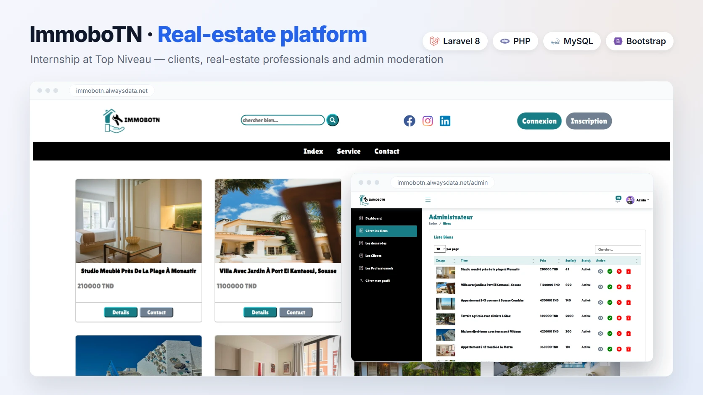

# ImmoboTN

A real estate marketplace for Tunisia that connects clients with real estate professionals, with an admin back office to moderate listings and users.


**[Live demo](https://immobotn.alwaysdata.net)** · **[Portfolio](https://portfolio.doua-automation.xyz/)**



## About

ImmoboTN was designed and developed end-to-end during a one-month internship in July 2022, as part of a bachelor's degree. It was my first Laravel project. The user interface is in French, as the platform targets the Tunisian market.

## Features

- **Clients**: browse and search properties, view photo galleries, contact professionals by email, track sent requests.
- **Professionals**: publish, edit and delete properties with multiple images, view requests received from clients.
- **Administrator**: dashboard with statistics, approval of new listings, account archiving, real-time notifications with Pusher.

## Tech Stack

- **Backend**: PHP 8.1, Laravel 8, MySQL
- **Frontend**: Blade, CSS, Bootstrap 5, jQuery
- **Services**: Pusher (real-time notifications), Mailtrap (SMTP)
- **Hosting**: alwaysdata

## Getting Started

### Prerequisites

- PHP 8.1 (the 2022 dependencies do not support PHP 8.2+)
- Composer
- MySQL

### Installation

```bash
git clone https://github.com/Doua-Gannouni/immobotn-project.git
cd immobotn-project
composer install
cp .env.example .env
php artisan key:generate
```

### Configuration

Set the following variables in `.env`:

| Variables | Purpose |
|---|---|
| `DB_*` | MySQL connection |
| `MAIL_*` | SMTP server used to send contact emails |
| `PUSHER_*`, `BROADCAST_DRIVER` | Real-time admin notifications (optional) |
| `ADMIN_EMAIL`, `ADMIN_PASSWORD` | Administrator account created by the seeder |

### Run

```bash
php artisan migrate --seed
php artisan serve
```

The application runs at `http://localhost:8000`, and the admin panel at `/administrateur`.

## Project Structure

```
app/Http/Controllers   Controllers for clients, professionals and the admin
app/Http/Middleware    Role-based access (admin, client, professionnel)
app/Models             User, Bien (property), Image, Contact
database/migrations    Database schema
resources/views        Blade views (client and admin interfaces)
```

## Author

**Doua Gannouni** · [Portfolio](https://portfolio.doua-automation.xyz/) · [GitHub](https://github.com/Doua-Gannouni)
